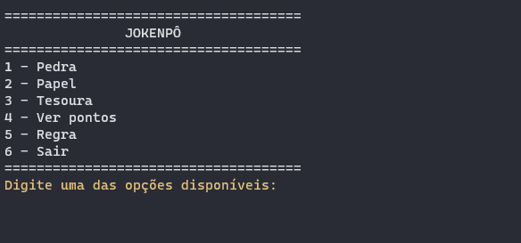

<h1 align="center">Jokenpô</h1>

Este é um jogo simples feito com a Linguagem de <b>Programação Python.</b>

    <a href="#como-funciona"> Como funciona o programa</a> - 
    <a href="#funcionalidades">Funcionalidades</a> -
    <a href="#escolhendo-pedra-papel-ou-tesoura">Escolhendo Pedra, Papel ou Tesoura</a> - 
    <a href="#vendo-os-pontos">Vendo os pontos</a> -
    <a href="#o-que-foi-usado-nesse-programa">O que foi usado no programa</a> -
    <a href="#referências">Referências</a>

---

## Como funciona o programa

- O menu principal conta com 6 opções. 
- As 3 primeiras opções são: Pedra, Papel e Tesoura. 
- A opção 4 mostra o menu de pontos. 
- A opção 5 mostra as regras do jogo para gerar um ganhador. 
- A opção 6 encerra o programa.

---

## Funcionalidades

- **Entrada de dados:**
  - O usuário pode escrever a opção desejada ou digitar o seu número equivalente.
  - Se o usuário escrever tudo em maiúsculo, o jogo irá identificar qual foi a opção que ele escolheu.
  - Todas as entradas tem validação de dados. Ou seja só será aceita as opções em destaque. Caso contrário, o jogo ficará solicitando a entrada correta.
- **Jogo:**
  - O computador gera sua própria opção de escolha entre pedra, papel e tesoura.
  - O jogo conta com um tempo de espera de 3s para cada interação do usuário. Isso faz com que dê tempo do usuário ler o que apareceu na tela.
  - Pós o tempo de espera, o jogo limpa a tela e mostra as opções novamente.
- **Cores:**
  - Se o usuário vence, o texto mostrando que ele venceu, fica verde.
  - Se o computador vence, o texto mostrando que o computador venceu, fica vermelho.
  - Se houver empate, o texto mostrando que teve empate, fica azul.
  - Todos os textos de entradas do usuário, fica em amarelo.

---

## Escolhendo Pedra, Papel ou Tesoura

- Você poderá digitar a opção numérica desejada ou de fato escrever entre pedra, papel e tesoura.
- Se o usuário ganhar da opção gerada pelo computador, ele recebe 1 ponto. Se o computador ganhar, o computador recebe 1 ponto. Caso tenha empate, o empate ganha 1 ponto.

    

---

## Vendo os pontos

- Podemos escrever por extenso o nome ou utilizar o número da opção.
- Dentro do menu de pontos, tem uma opção para poder voltar ao menu principal ou encerrar o programa.
- Todo o jogo tem a verificação dos dados digitados.
- Abaixo, mostro:
  - Escolhendo a opção de ver pontos
  - Digitando algo inválido
  - Voltando ao menu principal
  - Voltando ao menu de pontos
  - Encerrando o programa.

    

---

## Mostrando a Regra do Jogo e Encerrado o Programa

- No menu regra, temos a opção de voltar ao menu principal.
- Abaixo, mostro:
  - Escolhendo a opção regra
  - Voltando ao menu principal
  - Escolhendo a opção regra de outra forma
  - Voltando ao menu principal
  - Encerrando o programa.

    

---

## O que foi usado nesse programa

- **Bibliotecas**
  - [x] `time` -> Usamos a função `sleep()` da biblioteca **time** para gerar o tempo de espera do jogo.
  - [x] `os` -> Usamos a função `system()` da biblioteca **os** para fazer o comando de limpar a tela no terminal.
  - [x] `platform` -> Usamos a função `system()` da biblioteca **platform** para descobrir qual o sistema operacional que o usuário está utilizando.
  - [x] `random` -> Usamos a função `choice()` da biblioteca **random** para escolher aleatoriamente uma das opções  da tupla que passamos como referência.
- **Bibliotecas internas**
  - Criadas por mim mesmo.
  - [x] `menus` -> Todos os menus disponíveis no jogo.
  - [x] `funcoes` -> Funções para mudar a cor do texto, limpar a tela, esperar 3s e gerar a opção de sair. 
  - [x] `cond_ganhar` -> Função que verifica quem ganhou ou que teve empate e adiciona os pontos equivalente para cada resultado gerado.
- **Programas**
  - [x] ScreeToGif -> Criou os Gifs que foram utilizamos nesse README.

---

## Referências

- Desenho do menu e centralização do texto: 
  - Canal do YouTube [Curso em Video](https://www.youtube.com/watch?v=tapTa6KVG-A&t=894s&ab_channel=CursoemV%C3%ADdeo) exercício 045.
- Cores no terminal:
  - Canal do YouTube [Curso em Video](https://www.youtube.com/watch?v=0hBIhkcA8O8&ab_channel=CursoemV%C3%ADdeo) Curso de Python aula 11.
- Otimizando a condicional If:
  - Canal do YouTube [Programador Aventureiro](https://www.youtube.com/watch?v=uEK9DYzXEoQ&t=1069s&ab_channel=ProgramadorAventureiro)
- Como criar um bom README: 
  - Canal no YouTube [ARTHUR PC](https://www.youtube.com/watch?v=hzXNrOTM3VY&t=423s&ab_channel=ARTHURPC)

**- Todos os links de referência, já levam para o vídeo que utilizei como base.**